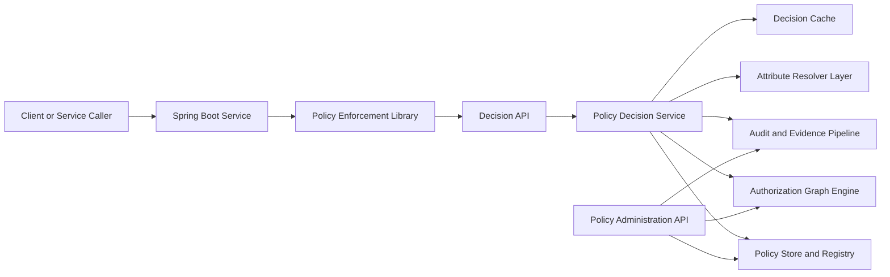
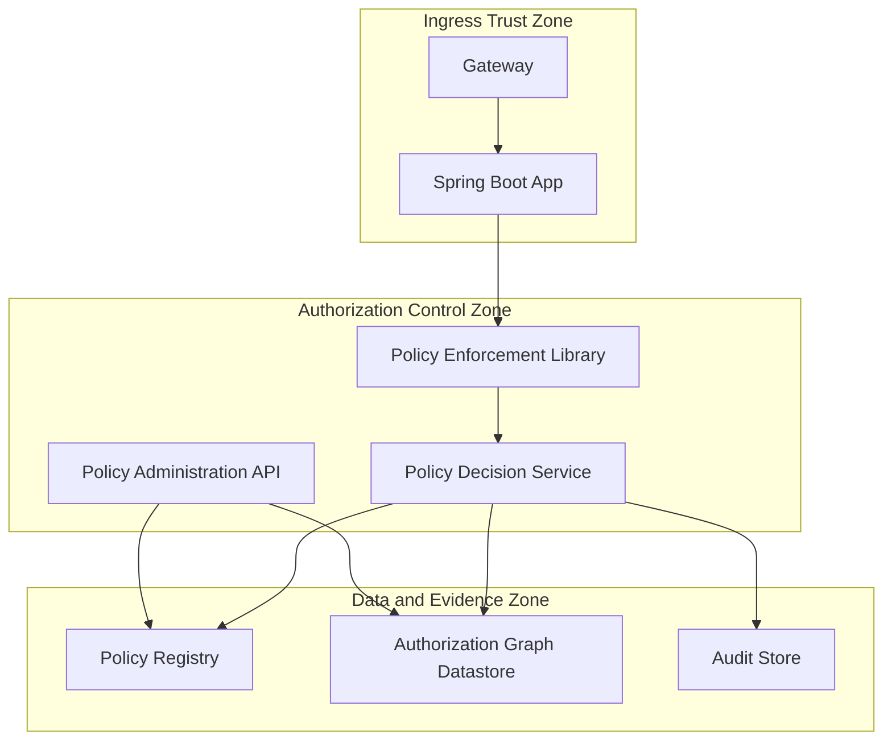
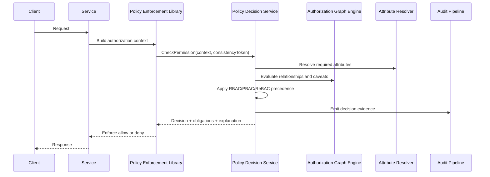
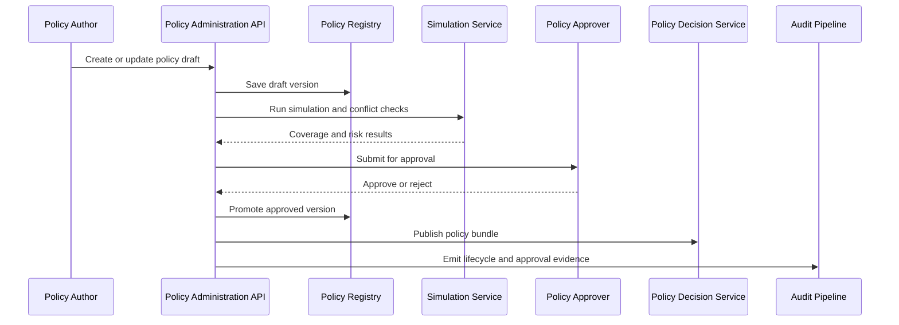

# Architecture Specification

## 1. Purpose

This document defines the target architecture for the Orthogonal Access Control Engine for Spring Boot microservices. It translates product requirements into an implementable technical blueprint covering platform components, interfaces, trust boundaries, resiliency model, and phased delivery.

## 2. Scope

In scope:

- Policy decision and policy administration architecture
- Spring Boot integration architecture
- Graph relationship and caveat evaluation architecture
- Multi-region, security, and observability architecture
- Enterprise policy governance architecture

Out of scope:

- UI design for policy authoring console
- Non-Java service SDK internals
- Vendor-specific deployment scripts

## 3. Architecture Principles

- Authorization is externalized from business logic.
- Explicit deny and boundary guardrails are non-bypassable.
- Relationship and attribute checks are evaluated in one decision context.
- Decision paths are explainable and auditable.
- Policy lifecycle is governed with separation of duties.
- Regional resilience and data protection are first-class concerns.

## 4. Logical Component Architecture

### 4.1 Component Responsibilities

- Policy Enforcement Library: Intercepts protected requests, constructs authorization input, enforces outcomes.
- Decision API: Exposes CheckPermission and LookupResources interfaces.
- Policy Decision Service: Evaluates RBAC, PBAC, ReBAC, obligations, and precedence.
- Policy Store and Registry: Stores policy definitions, versions, ownership metadata, approvals, and release states.
- Authorization Graph Engine: Stores relationships and evaluates graph-based permissions with caveat context.
- Attribute Resolver Layer: Hydrates and validates runtime context attributes from trusted sources.
- Audit and Evidence Pipeline: Persists decision evidence and policy lifecycle events.

## 5. Trust and Security Boundaries

Security controls:

- Mutual authentication on all service-to-service calls.
- Strong authentication and role-based authorization on admin APIs.
- Immutable or append-safe audit/evidence storage.
- Encryption in transit and at rest.
- Key and secret rotation without downtime.

### 5.1 Threat Model and Mitigation Mapping

| Threat Scenario | Primary Risk | Required Controls |
|---|---|---|
| Token replay across service boundaries | Unauthorized decision reuse | Short-lived tokens, nonce or replay detection, mTLS, audience validation |
| Forged delegated identity chain | Privilege escalation | Signed caller chain, strict issuer validation, delegation expiry checks |
| Graph relationship poisoning | Unauthorized broad access | Write authorization on relationship mutations, dual approval for high-impact mutations, immutable audit trail |
| Stale policy or relationship reads | Incorrect allow after revocation | Consistency-token enforcement for critical paths, bounded cache TTLs, rollback and propagation SLOs |
| Admin API abuse | Unauthorized policy publication | Maker-checker, separation of duties, approval quorum, high-signal admin audit events |

Minimum detection and response requirements:

- Alert on denied-to-allowed rate anomalies after policy promotion.
- Alert on failed token validation spikes and caller-chain verification failures.
- Alert on high-risk relationship mutation volumes by tenant or domain.
- Alert on consistency-token bypass attempts for critical endpoints.

## 6. Authorization Data Model

### 6.1 Orthogonal Evaluation Dimensions

- Regulatory boundary: market and line of business
- Channel boundary: staff and customer path separation
- Relationship boundary: hierarchical and direct relationship checks

### 6.2 Core Entities

- Subject
- Role
- Permission
- Policy
- Policy Set
- Resource Type
- Resource Instance
- Relationship Edge
- Tenant
- Attribute Definition
- Decision Log

### 6.3 Authorization Evaluation Contract

Required evaluation input:

- Subject context
- Action and resource context
- Organization and tenant scope
- Runtime caveat context
- Consistency token for causal safety

Required evaluation output:

- Decision and decision code
- Matched policies
- Obligations
- Explanation and evidence references

## 7. Runtime Flows

### 7.1 CheckPermission Flow

### 7.2 LookupResources Flow

- Caller submits resource discovery request with subject context and action.
- Decision service issues graph-backed resource lookup constrained by boundaries.
- Only authorized resource identifiers are returned.
- Application avoids post-filtering and overexposure risk.

### 7.3 Policy Change and Causal Safety Flow

- Policy or relationship mutation occurs via administration API.
- Mutation returns an updated consistency token.
- Downstream critical checks include token to guarantee read-after-write behavior.

### 7.4 Policy Authoring to Production Flow

Failure handling:

- Failed simulation blocks approval submission.
- Failed publish triggers automatic rollback to last known good bundle.
- Approval rejection records rationale and returns policy to draft state.

## 8. Policy Lifecycle Architecture

### 8.1 Lifecycle States

- Draft
- Validated
- Approved
- Staged
- Active
- Deprecated
- Retired

### 8.2 Release Gates

All promotions require:

- Schema and semantic validation
- Conflict and precedence analysis
- Simulation coverage threshold
- Blast-radius classification
- Approval quorum based on criticality
- Rollback objective and runbook

### 8.3 Governance Model

- Maker-checker for production changes
- Separation of duties for author, approver, owner
- Domain ownership by market, line of business, channel, tenant
- Certification cadence and expiry controls

## 9. Deployment Architecture

### 9.1 Topology

- Active region hosts full authorization control plane and data plane.
- Secondary region hosts warm or active standby based on target RTO and RPO.
- Spring Boot services are deployed close to authorization endpoints to minimize latency.

Regional hosting blueprint:

- Per region runtime components:
  - 3+ replicas of decision service across availability zones
  - 2+ replicas of administration API across availability zones
  - 3+ replicas of authorization graph data nodes (or managed equivalent)
  - Dedicated policy registry and audit storage nodes
- Ingress:
  - Regional private ingress for service-to-service authorization traffic
  - Separate admin ingress with tighter access controls

### 9.1.1 Network Segmentation Model

- Ingress zone: API gateway and edge termination.
- Control zone: decision and administration services.
- Data zone: policy store, graph datastore, audit store.
- East-west traffic between zones must be mutually authenticated and policy-controlled.
- Admin-plane access must be restricted via privileged network paths and just-in-time access controls.

### 9.1.2 Capacity and Autoscaling Baseline

Initial baseline targets:

- Decision service: auto-scale on CPU, memory, and p95 latency.
- Graph query tier: auto-scale on request rate and queue depth.
- Cache tier: scale on miss-rate and memory pressure.

Capacity planning assumptions (to be validated in performance testing):

- 10,000 authorization checks per second shared profile.
- 95 percent cache hit ratio at steady state.
- Burst tolerance of at least 2x baseline for 5-minute windows.

### 9.2 Multi-Region Strategy

- Replicate policy and relationship data across regions.
- Define consistency expectations for decision reads and write propagation.
- Maintain signed policy bundles for bounded degraded-mode operation.

### 9.3 Failure Modes

- Control-plane unavailable: enforce last known good policy bundle.
- Datastore lag or partition: use explicit consistency token mode for critical requests.
- Dependency timeout: fail according to endpoint fail-closed or approved fail-open class.

### 9.4 Backup, Restore, and DR Operations

- Backup scope:
  - Policy registry data and version history
  - Relationship datastore snapshots and logs
  - Audit evidence store
- Backup frequency:
  - Continuous log shipping where supported
  - Daily full backups with point-in-time recovery
- Restore requirements:
  - Policy integrity and approval metadata must remain intact
  - Relationship data consistency must be validated before cutover
  - Audit chain continuity checks are mandatory post-restore

Runbook requirements:

- Documented regional failover steps with role ownership.
- Quarterly DR exercises including policy rollback and consistency-token validation.
- Post-incident verification checklist for decision correctness and audit completeness.

## 10. Performance and Scalability Architecture

Target metrics:

- P95 CheckPermission under 5 ms
- P99 complex graph evaluations under 15 ms
- Cache hit ratio above 95 percent in steady state

Scalability design:

- Stateless decision service horizontal scale
- Partitionable relationship storage by tenant or domain
- Read-optimized caching for policy and relationship hot paths
- Bulk and streaming lookup interfaces for list workloads

## 11. Observability and Audit Architecture

### 11.1 Metrics

- Decision latency percentiles
- Allow and deny rates
- Cache hit ratio
- Resolver failure rates
- Policy publication and rollback events

### 11.2 Logs and Traces

- Correlation ID propagation from caller to decision pipeline
- Structured decision logs with evidence references
- Trace spans across enforcement, decision, resolver, and datastore layers

### 11.2.1 Security Monitoring and Alerting

- Detect anomalous deny or allow rate shifts after policy changes.
- Detect unusual privileged admin actions, especially break-glass activation and global policy updates.
- Detect consistency-token mismatches on critical endpoint traffic.
- Detect abnormal relationship mutation spikes by tenant, market, or channel.

### 11.3 Compliance Evidence

- Active schema version
- Evaluated caveat context references
- Policy version and matched rule identifiers
- Approval history for active policy state

## 12. API Architecture

### 12.1 Decision APIs

- CheckPermission
- LookupResources

### 12.2 Administration APIs

- Policy CRUD and versioning
- Approval workflow and promotion
- Relationship management
- Simulation and validation
- Audit query
- Schema and caveat migration management

### 12.3 API Standards

- Machine-readable schemas
- Stable semantic versioning
- Structured error taxonomy with retryability hints
- Idempotent mutation semantics where retries occur

## 13. Implementation Roadmap

### Phase 1: Foundation

- Build policy enforcement library for Spring Boot
- Stand up decision service and baseline policy registry
- Implement CheckPermission for RBAC and core PBAC

### Phase 2: Graph and Boundary Enforcement

- Integrate authorization graph engine
- Implement caveat-aware relationship evaluation
- Deliver LookupResources with boundary-constrained discovery

### Phase 3: Governance Hardening

- Enable full release gates and maker-checker workflows
- Implement certification SLA and policy catalog controls
- Expand delegated administration with bounded scope controls

### Phase 4: Multi-Region and Reliability

- Complete multi-region replication and tested failover procedures
- Enforce consistency token path for critical operations
- Tune performance to target percentiles under production-like load

## 14. Architecture Decisions to Confirm

- Datastore pattern for relationship and policy workloads by phase
- Quantitative thresholds for simulation coverage by risk class
- Approval quorum and seniority matrix for critical policy changes
- Endpoint classification rules for fail-open exceptions

## 15. Exit Criteria for Production Architecture Readiness

- End-to-end authorization flow validated for RBAC, PBAC, ReBAC
- Governance controls active and auditable in production
- DR exercises meet defined RTO and RPO objectives
- Performance SLOs achieved under representative workload
- Compliance evidence generation validated with audit stakeholders